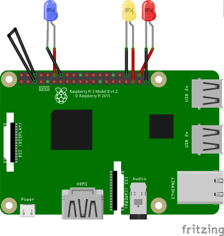

# Field Test

### NASA SmallSat Project - Colorado School of Mines

Name | Email | Cell
--- | --- | ---
Zachary Smeton | zsmeton@yahoo.com | (303) 880-9437


## Description
Class and program which can be used to test that [Hardware Hello AODV](../hardware/hardware_hello_aodv.h) works properly. This runs a script where RPI 1 and RPI 2 send messages between eachother. And then three leds are lit up for each message that gets handled. See SmallSat Documentation on the overall test and results. 

## How to use this code:
0. Pull code onto the pis
1. Modify code based on the RPI being tested:
   1. Turn off debug messages by changing DEBUG to 0 [here](../defines.h)
   2. Make sure RPI is 1 [here](../defines.h)
   3. If RPI 1: all good
   4. If RPI 2: change MY_IP_ADDR to "192.168.1.2" [here](../defines.h) and ```vector<string> ips = { "192.168.1.2" };``` to ```vector<string> ips = { "192.168.1.1" };``` [here](main.cc)
   5. Else: change MY_IP_ADDR to "192.168.1.$RPI_NUMBER" [here](../defines.h) and ```vector<string> ips = { "192.168.1.2" };``` to ```vector<string> ips = {};``` [here](main.cc)
2. Run the following commands from the root directory
```bash
$ make clean-all
$ make all -j
$ cd field_test
$ make clean
$ make -j
```
3. Plug in lights and shorting wire using the following wiring diagram 
   
    

4. Once rebooted in ADHOC mode run ./main

## File Insights
[field_test_defines](field_test_defines.h) - Defines used for debugging, logging, and hyperparameters for the code. 

[harware_led_aodv](harware_led_aodv.h) - Implementation of [hardware hello aodv](../hardware/hardware_hello_aodv.h) where three leds will be lit up depending on the messages received.

[led_helper](led_helper.h) - Function which uses system to call light_led.py 

[light_led](light_led.py) - Python script which lights up an led n times for m miliseconds with a 100 ms wait time in between

[main](main.cc) - The actual program which sends messages between the nodes and handles packets


